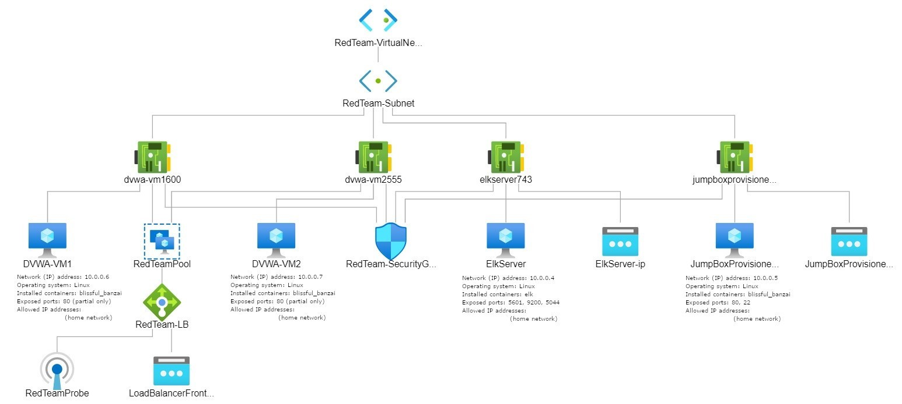
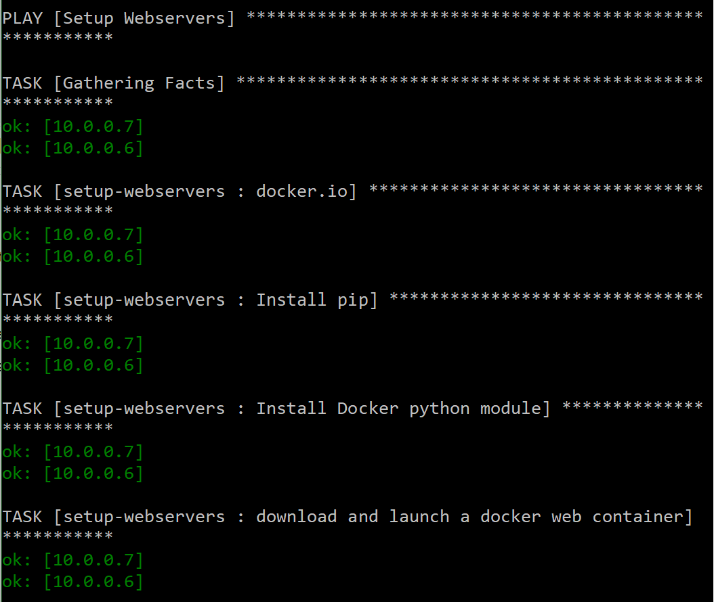
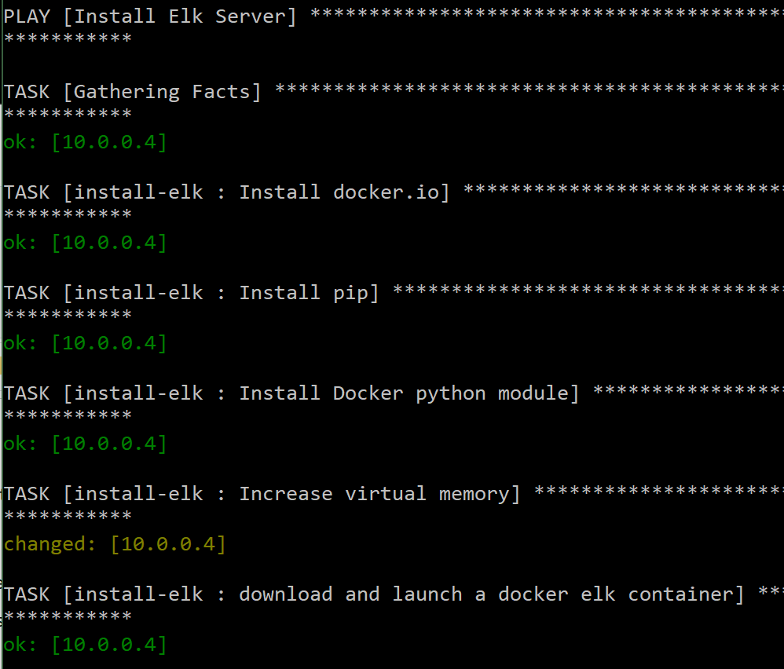
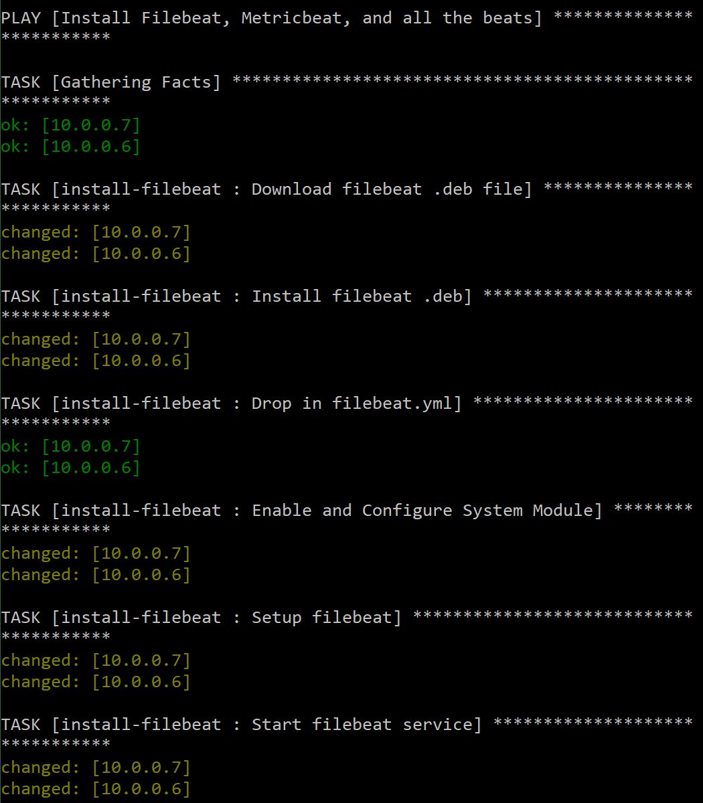
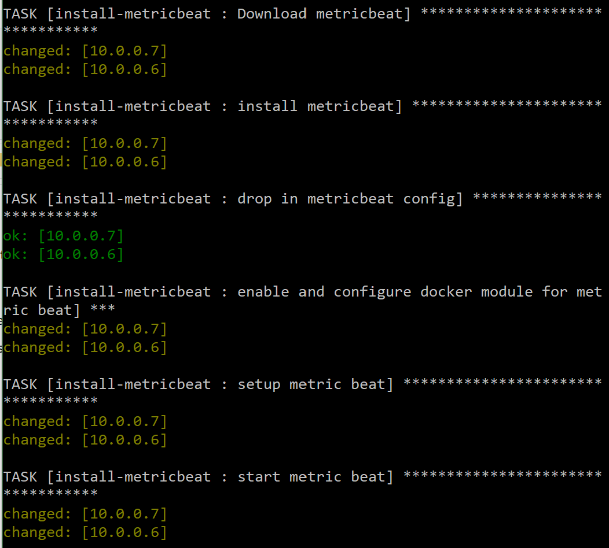
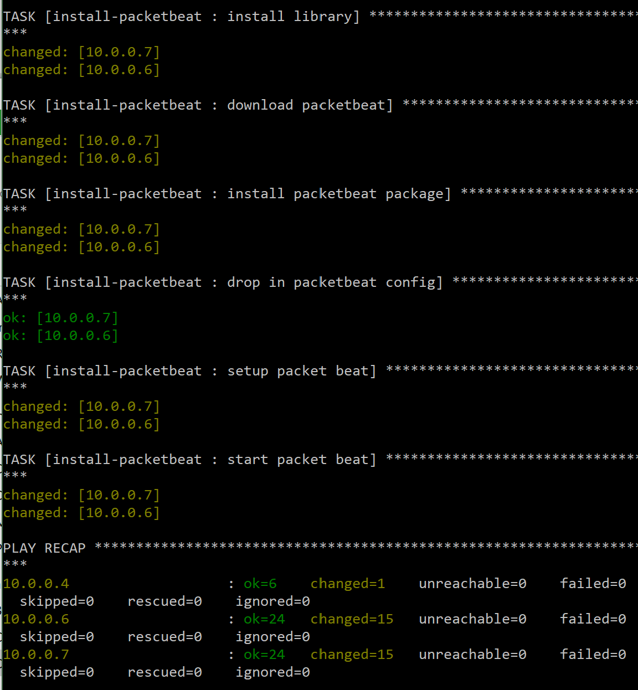
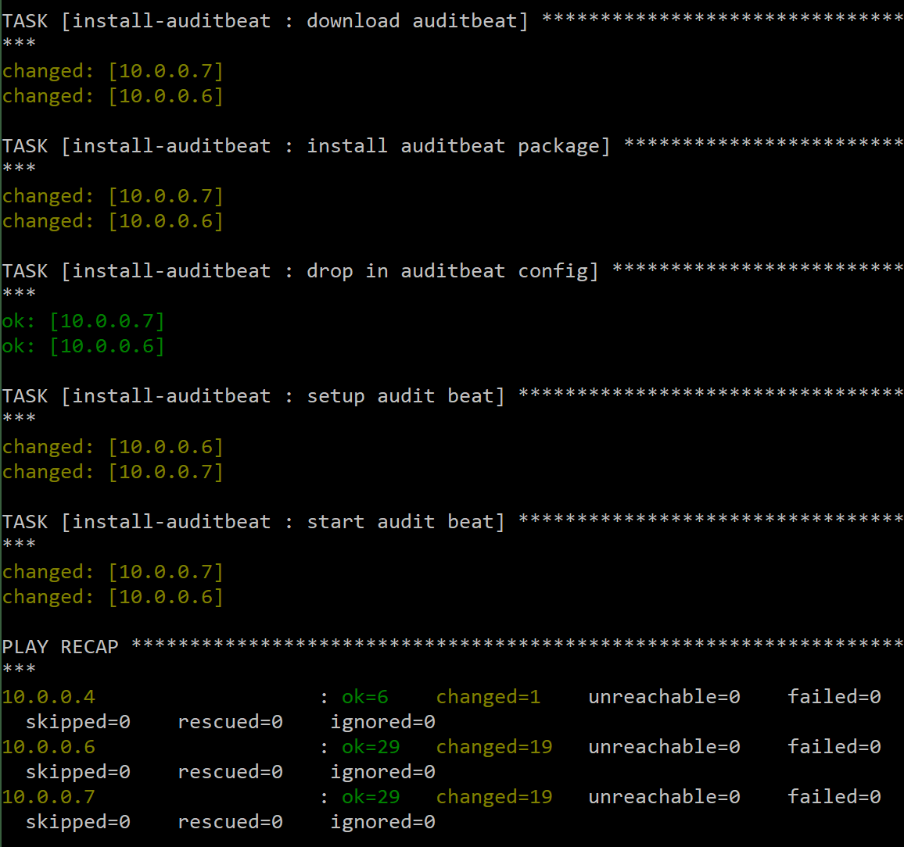
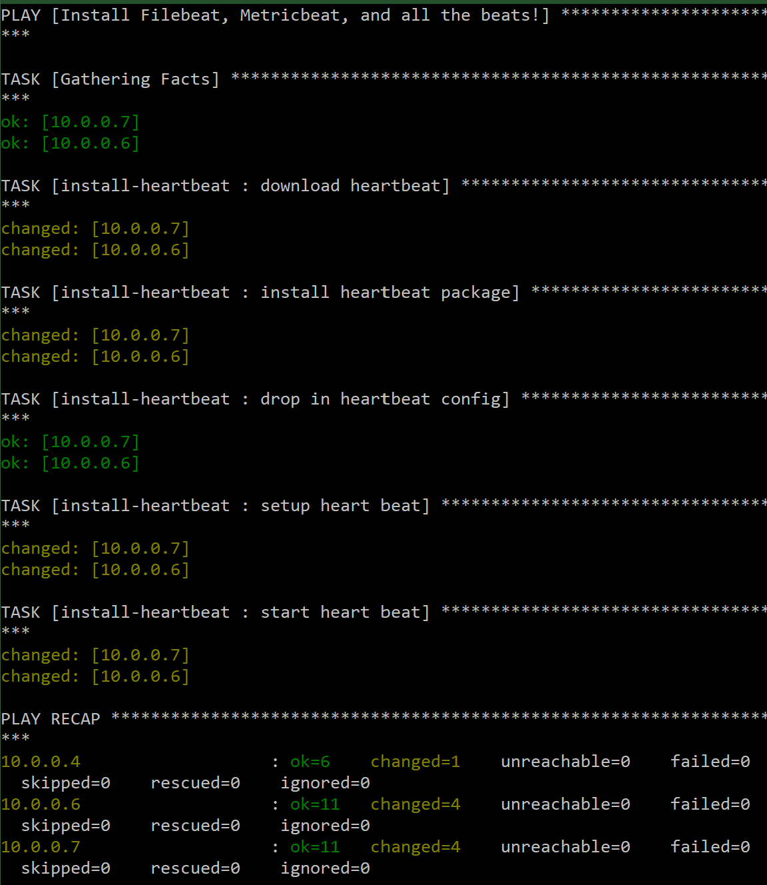

## Automated ELK Stack Deployment

The files in this repository were used to configure the network depicted below.



These files have been tested and used to generate a live ELK deployment on Azure. They can be used to either recreate the entire deployment pictured above.

Alternatively, select portions of the main.yml file may be used to install only certain pieces of it, such as Filebeat.

  - _roles/main.yml_

This document contains the following details:
- Description of the Topology
- Access Policies
- ELK Configuration
  - Beats in Use
  - Machines Being Monitored
- How to Use the Ansible Build

### Description of the Topology

The main purpose of this network is to expose a load-balanced and monitored instance of DVWA, the D*mn Vulnerable Web Application.

Load balancing ensures that the application will be highly available, in addition to restricting access to the network.

Integrating an ELK server allows users to easily monitor the vulnerable VMs for changes to the logs and system metrics.

The configuration details of each machine may be found below.

| Name       | Function  | IP Address | Operating System |
|------------|-----------|------------|------------------|
| Jump Box   | Gateway   | 10.0.0.5   | Linux            |
| DVWA-VM1   | Webserver | 10.0.0.6   | Linux            |
| DVWA-VM2   | Webserver | 10.0.0.7   | Linux            |
| ELK Server | Elkserver | 10.0.0.4   | Linux            |

### Access Policies

The machines on the internal network are not exposed to the public Internet. 

Only the Jump Box machine can accept connections from the Internet. Access to this machine is only allowed from the following IP addresses: ~~redacted~~ (home network IP)

Machines within the network can only be accessed by ~~redacted~~ (home network IP).

A summary of the access policies in place can be found in the table below.

| Name       | Publicly Accessible | Allowed IP Addresses                    |
|------------|---------------------|-----------------------------------------|
| Jump Box   | No                  | ~~redacted~~ (home network IP)          |
| DVWA-VM1   | No                  | 10.0.0.5 ~~redacted~~ (home network IP) |
| DVWA-VM2   | No                  | 10.0.0.5 ~~redacted~~ (home network IP) |
| ELK Server | No                  | 10.0.0.5 ~~redacted~~ (home network IP) |

### Elk Configuration

Ansible was used to automate configuration of the ELK machine. No configuration was performed manually, which is advantageous because it increases accuracy, by eliminating human error in retyping commands and it saves time.

Roles were also utilized to increase re-usability. A main.yml file references the main.yml within each ansible role to run each playbook with one command. The main file can easily be edited to add or remove roles and therefore which playbooks are run.

The main playbook implements the following roles, which then implement the individual playbooks listed below:
- Setup Webservers
- Install Elk Server
- Install Filebeat
- Install Metricbeat
- Install Packetbeat
- Install Auditbeat
- Install Heartbeat

The setup-webservers playbook implements the following tasks:
- Install Docker
- Install pip
- Install Docker python module
- Download and launch docker web container

The install-elk playbook implements the following tasks:
- Install Docker
- Install pip
- Install Docker python module
- Increase virtual memory
- Download and launch docker elk container

The install-filebeat playbook implements the following tasks:
- Download filebeat .deb file
- Install filebeat
- Drop in filebeat.yml
- Enable and Configure System Module
- Setup filebeat
- Start filebeat service

The install-metricbeat playbook implements the following tasks:
- Download metricbeat .deb file
- Install metricbeat
- Drop in metricbeat.yml
- Enable and Configure docker module for metricbeat
- Setup metricbeat
- Start metricbeat service

The install-packetbeat playbook implements the following tasks:
- Download packetbeat .deb file
- Install packetbeat
- Drop in packetbeat.yml
- Setup packetbeat
- Start packetbeat service

The install-auditbeat playbook implements the following tasks:
- Download auditbeat .deb file
- Install auditbeat
- Drop in auditbeat.yml
- Setup auditbeat
- Start auditbeat service

The install-heartbeat playbook implements the following tasks:
- Download heartbeat .deb file
- Install heartbeat
- Drop in heartbeat.yml
- Setup heartbeat
- Start heartbeat service

The following screenshots display the results of running `docker ps` after successfully configuring the ELK instance.

#### Webservers Playbook Output


#### Install Elk Playbook Output


#### Install Filebeat Playbook Output


#### Install Metricbeat Playbook Output


#### Install Packetbeat Playbook Output


#### Install Auditbeat Playbook Output


#### Install Heartbeat Playbook Output


### Target Machines & Beats
This ELK server is configured to monitor the following machines:
- 10.0.0.6
- 10.0.0.7

We have installed the following Beats on these machines:
- filebeat
- metricbeat
- packetbeat
- auditbeat
- heartbeat

These Beats allow us to collect the following information from each machine:
- Filebeat allows for a lightweight way to forward and centralize logs and files. This provides a GUI and infographic view in order to track down curious behavior across aggregated logs.
- Metricbeat allows for a lightweight way to send system and service statistics. This provides a GUI and infographic view of system-level CPU usage, memory, file system, disk IO, network IO statistics, and top-like statistics for every process running on your systems.
- Packetbeat is a real-time network packet analyzer that can provide application monitoring and performance analytics.  It captures the network traffic between your application servers. It can help you notice issues with your back-end application.
- Auditbeat collects your Linux audit framework data and monitors the integrity of files in real-time. 
- Heartbeat monitors services for the availability with active probing. Heartbeat easily generates uptime and response time data.

### Using the Playbook
In order to use the playbook, you will need to have an Ansible control node already configured. Assuming you have such a control node provisioned: 

SSH into the control node and follow the steps below:
```command
ssh -i <key_name/location> <username>@<Jump-Box-Public-IP>
sudo docker start <container_name>
sudo docker attach <container_name>
```
- Copy the entire roles folder, including subfolders and files to /etc/ansible/roles/.
- Update the host file to include the IP addresses for the webservers and the elkserver.
- Update each configuration file with the following information:
  - kibana host (uncomment and replace localhost with your local IP for your ELK server)
  - elastic.search output (uncomment and replace localhost with your local IP for your ELK server)
- Run the playbook, and navigate to ``` http://<Elk-Server-Public-IP>:5601 ``` to check that the installation worked as expected.
```command
ansible-playbook /etc/ansible/main.yml
```
