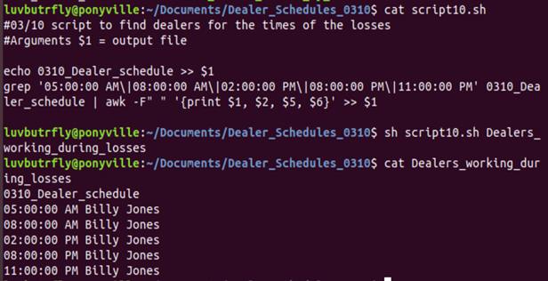
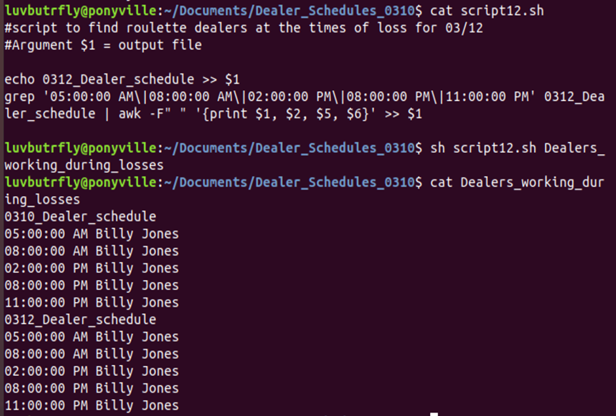
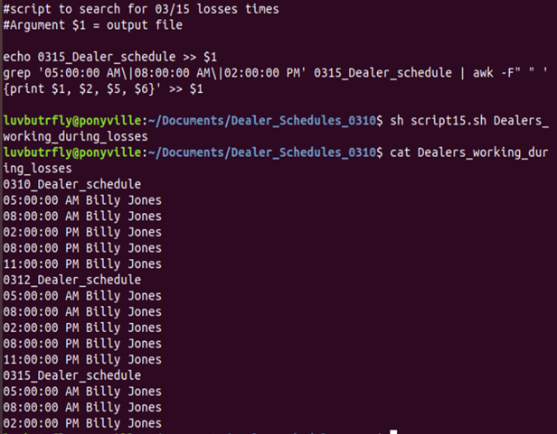
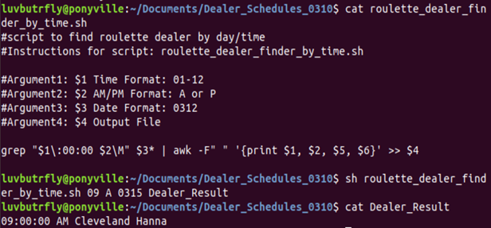
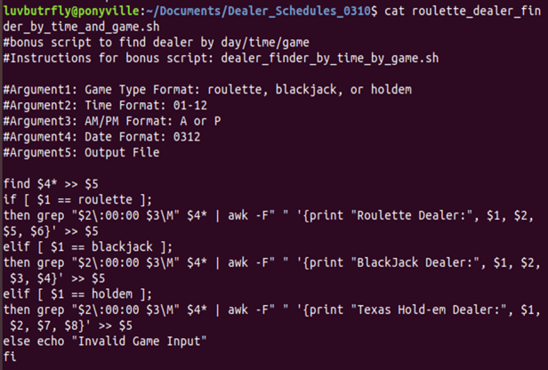
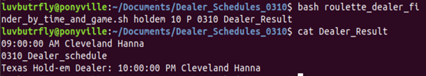

## Terminal Homework:
♣♦♠♥ A High Stakes Investigation ♣♦♠♥!
## Lucky Duck Security Investigation Instructions
#### Dealer Analysis   

### Step 4: Scripting your Tasks

**Bonus:**  In case there is future fraud on the other Lucky Duck Games, create a shell script called `roulette_dealer_finder_by_time_and_game.sh` that has the three following arguments:

